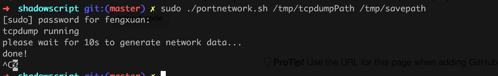
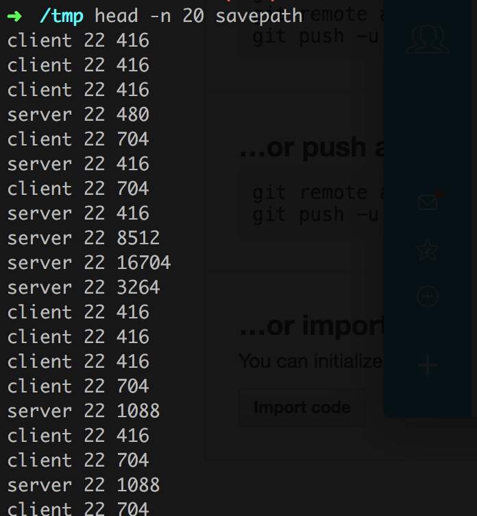

##流量统计

基于TCPDUMP抓包得到的结果，在使用awk解析得到的基于端口的流量统计
<a href="http://www.socks5s.com/">http://www.socks5s.com/</a> 网站上使用的流量统计就是基于这个分析的。

运行： sudo ./portnetwork.sh tcpdumppath savepath

查看结果:  

> 2017/1/8 
